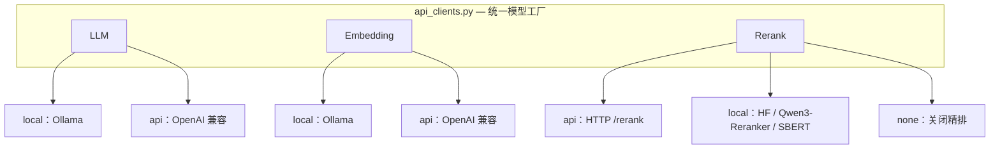
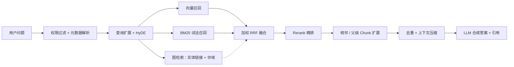

<h1 align="center">PCB-RAG</h1>

<p align="center"><b>面向 PCB 知识库的检索增强生成（RAG）问答系统</b></p>

<p align="center">
  文档入库 · 向量检索 · BM25 词法召回 · 多路融合 · Rerank 精排 · Dify 集成
</p>

<p align="center">
  <a href="https://github.com/MarkITwains/RAG/actions/workflows/ci.yml"></a>
  
  
  
  
  
</p>

<p align="center">博客文章：<a href="https://blog.eecs.top/index.php/archives/3/">https://blog.eecs.top/index.php/archives/3/</a></p>

---

PCB-RAG 面向 PCB 设计规范、工艺资料与工程经验文档，覆盖从文档预处理、结构切块入库，到混合检索、重排序、答案合成与对外服务的完整链路，可用于构建 PCB 领域的智能问答助手。

## 目录

- [项目亮点](#项目亮点)
- [系统架构](#系统架构)
- [技术栈](#技术栈)
- [目录结构](#目录结构)
- [快速开始](#快速开始)
- [检索链路](#检索链路)
- [Dify 外部知识库 API](#dify-外部知识库-api)
- [配置说明](#配置说明)
- [评测](#评测)
- [常见问题](#常见问题)
- [开发意义](#开发意义)
- [公开仓库说明](#公开仓库说明)
- [License](#license)

## 项目亮点

| 亮点 | 说明 |
| --- | --- |
| **本地 / API 双后端** | LLM、Embedding、Rerank 均支持「本地服务」与「OpenAI 兼容 API」两种后端，通过 `*_BACKEND` 环境变量切换，不锁定厂商 |
| **一键环境补全** | `scripts/setup.sh` 自动创建虚拟环境、安装依赖、生成 `.env`、启动 Milvus，并按后端检查模型可用性 |
| **领域化文档处理** | 面向 PCB 规范、EDA 工具文档与工艺参数，内置编码修复、OCR 乱码清理、结构感知切块与元数据抽取 |
| **混合检索架构** | Milvus 向量检索 + BM25 词法检索 + HyDE 查询扩展 + 加权 RRF 多路融合，提升专业问题召回率 |
| **查询理解** | 意图识别与动态权重、复合问题自动分解、过于具体的问题自动 Step-back 补充背景知识 |
| **Agentic RAG** | 可选的迭代检索：检索 → 充分性判断 → 信息不足则改写查询重检，直到满足或达到迭代上限 |
| **Contextual Retrieval** | 入库时为每个 chunk 注入「文档 · 章节 · 标准号」语境前缀，缓解切块导致的上下文丢失 |
| **可切换精排** | 支持 API 精排（Jina / 硅基流动等）与本地精排（Qwen3-Reranker / cross-encoder / SBERT） |
| **上下文扩展** | 命中的 chunk 自动并入相邻 chunk（`prev_id`/`next_id`）与父块锚点内容，缓解长文档上下文割裂 |
| **Dify 集成** | 提供符合规范的 FastAPI 外部知识库接口，可直接接入 Dify 工作流或对话应用 |
| **GraphRAG 图检索** | 入库时抽取「实体—关系—实体」三元组构成可遍历图谱，检索时做实体链接与邻域扩展，补足多跳与聚合类问题 |
| **上下文压缩** | 近似去重 + 抽取式压缩 + 字符预算裁剪，在长召回链路上显著降低 token 消耗 |
| **多租户权限** | 按租户 / 角色 / 组做检索级过滤（向量库表达式 + 内存兜底双层），并支持访问审计 |
| **可观测性** | 结构化 tracing（JSONL）、计数器与延迟分位，`/metrics` 直接暴露 |
| **多模态** | PDF 图片经视觉模型转成可检索描述，表格结构化为 Markdown，列值对应关系不再丢失 |
| **标准工程结构** | `src/pcb_rag` 包结构 + `pyproject.toml`，便于安装、导入与维护 |

## 系统架构

### 模型层：本地 / API 双后端



### 检索链路



## 技术栈

| 层次 | 组件 |
| --- | --- |
| 语言 | Python 3.10+ |
| RAG 框架 | LlamaIndex |
| 向量数据库 | Milvus 2.6（Docker Compose 一键启动） |
| 模型服务 | OpenAI 兼容 API / Ollama / HuggingFace Transformers |
| 服务框架 | FastAPI + Uvicorn |
| 外部集成 | Dify External Knowledge API |
| 分词与检索 | jieba 领域词典 + 本地 BM25+ 词法索引 |

## 目录结构

```text
.
├── .env.example                  # 环境变量模板（本地 / API 双后端）
├── .gitlab-ci.yml                # CI：lint + pytest
├── .github/workflows/ci.yml      # GitHub Actions：ruff 静态检查 + 构建 + pytest
├── requirements.txt              # Python 依赖
├── pyproject.toml                # Python 包配置
├── src/pcb_rag/                  # 核心源码包
│   ├── api_clients.py            # LLM / Embedding / Rerank 双后端工厂
│   ├── cache.py                  # 语义缓存（精确匹配 + 向量相似）
│   ├── ingest.py                 # 文档预处理、切块与入库
│   ├── query.py                  # 检索链路与交互式问答
│   ├── preprocess_docs.py        # 编码修复与乱码清理
│   └── dify_external_api.py      # Dify 外部知识库 API 服务
├── tests/                        # 单元测试（缓存 / 评测指标 / 文档预处理）
├── eval/                         # 评测体系（黄金集 + 四指标）
│   ├── build_golden_dataset.py   # 数据集构建
│   ├── metrics.py                # 忠实度 / 相关性 / 精确率 / 召回率
│   └── evaluate.py               # 评测主脚本
├── scripts/                      # 一键安装与运行脚本
│   ├── setup.sh                  # 环境一键补全
│   ├── check_env.py              # 环境自检
│   ├── run_ingest.sh             # 文档入库
│   ├── run_query.sh              # 交互式问答
│   ├── serve_api.sh              # 启动 API 服务
│   └── run_optimized.sh          # 交互式参数配置脚本
├── docker/milvus/docker-compose.yml
├── data/README.md                # 数据目录说明
└── docs/                         # 配置、集成与优化文档
```

## 快速开始

### 前置要求

- Python 3.10+
- Docker 与 Docker Compose（用于启动 Milvus）
- 模型服务（二选一）：
  - 本地：安装并启动 [Ollama](https://ollama.com/)
  - API：准备任意 OpenAI 兼容服务的 `BASE_URL` 与 `API_KEY`

### 1. 一键补全环境

```bash
bash scripts/setup.sh
```

脚本执行内容：

| 步骤 | 内容 |
| --- | --- |
| 1 | 创建 `.venv` 虚拟环境 |
| 2 | 安装 `requirements.txt`，并执行 `pip install -e .` |
| 3 | 从 `.env.example` 生成 `.env` |
| 4 | 创建 `data/clear_docs/`、`data/raw_docs/`、`logs/` |
| 5 | 启动 `docker/milvus/docker-compose.yml` |
| 6 | 按 `LLM_BACKEND` / `EMBED_BACKEND` 检查模型后端 |
| 7 | 运行 `scripts/check_env.py` 完成环境自检 |

### 2. 配置模型后端

编辑 `.env` 选择后端，三者可自由混搭。

**全本地（Ollama）**

```bash
LLM_BACKEND=local
EMBED_BACKEND=local
OLLAMA_LLM_MODEL=qwen3.5:35b-a3b-q4_K_M
OLLAMA_EMBED_MODEL=qwen3-embedding:8b-q8_0
```

**全 API（OpenAI 兼容，以硅基流动为例）**

```bash
LLM_BACKEND=api
EMBED_BACKEND=api
LLM_BASE_URL=https://api.siliconflow.cn/v1
LLM_API_KEY=sk-xxxx
LLM_MODEL=Qwen/Qwen3-8B
EMBED_MODEL=BAAI/bge-m3
EMBED_DIM=1024
```

**Rerank 后端**

```bash
# API 精排（推荐，无需本地显存）
RERANK_BACKEND=api
RERANK_API_URL=https://api.jina.ai/v1/rerank
RERANK_API_KEY=xxxx
RERANK_API_MODEL=jina-reranker-v2-base-multilingual

# 本地精排（可选 hf / qwen3reranker / sbert），或 none 关闭
RERANK_BACKEND=qwen3reranker
```

> 混搭示例：LLM 走 API、Embedding 走本地，只需分别设置 `LLM_BACKEND` 与 `EMBED_BACKEND`。

### 3. 准备数据

公开仓库不包含任何原始语料。请将你有权使用的 PCB 文档放入：

```text
data/clear_docs/
```

### 4. 文档入库

```bash
bash scripts/run_ingest.sh      # 等价：python -m pcb_rag.ingest
```

> 默认增量写入（`INGEST_OVERWRITE=0`）；如需清空重建集合，设置 `INGEST_OVERWRITE=1`。

### 5. 运行问答

```bash
bash scripts/run_query.sh       # 等价：python -m pcb_rag.query
```

示例问题：

```text
4 层 PCB 的阻抗控制需要关注哪些参数？
Altium Designer 中如何处理高速差分线等长？
```

## 检索链路

| 阶段 | 说明 |
| --- | --- |
| 权限过滤 | 按请求头解析出的租户 / 角色生成 ACL 条件，与业务过滤以 AND 合并，在召回阶段就挡掉无权数据 |
| 元数据过滤解析 | 从问题中提取 `vendor` / `eda` / `layer_count` / `copper_oz` 等条件，缩小检索范围 |
| 查询理解 | 规则 + LLM 混合的意图识别，输出查询类型与动态检索权重 |
| 查询分解 | 复合问题拆成多个子问题分别召回，缓解多跳问题漏召 |
| 查询扩展 | PCB 同义词与缩写扩展，提升专业术语召回 |
| HyDE 增强 | 生成假设文档参与向量检索，缓解短查询语义稀疏问题 |
| Step-back | 过于具体的问题抽象为上位问题，单独一路召回补充背景知识 |
| 多路召回 | 向量检索与 BM25 词法检索并行执行 |
| 加权 RRF 融合 | 按查询类型动态调整各路线权重并融合排序 |
| Rerank 精排 | 使用 API 或本地 cross-encoder 对候选重排序 |
| 上下文扩展 | 命中 chunk 并入相邻 / 父级 chunk，保持上下文完整 |
| GraphRAG 图检索 | 实体链接命中图谱后取邻域关系与原文依据，作为独立一路（有独立权重与 rank）参与 RRF 融合，并顺带补全多跳事实 |
| 权限复核 | 对召回结果逐条复核，向量库过滤被忽略时也能兜底拦截 |
| 上下文压缩 | 近似去重 → 抽取式压缩（优先保留含数值 / 标准号的句子）→ 字符预算裁剪 |
| 答案合成 | 基于 RAG Prompt 生成答案并标注引用来源 |

## Dify 外部知识库 API

```bash
bash scripts/serve_api.sh
# 等价：uvicorn pcb_rag.dify_external_api:app --host 0.0.0.0 --port 8000
```

在 Dify 外部知识库中配置：

| 配置项 | 值 |
| --- | --- |
| URL | `http://<your-server-host>:8000/retrieval` |
| API Key | `Bearer <your DIFY_API_TOKEN>` |

主要端点：

| 端点 | 说明 |
| --- | --- |
| `POST /retrieval` | Dify 外部知识库规范接口，返回命中的 records |
| `POST /api/ask` | 检索 + LLM 合成答案，支持传入对话历史 |
| `POST /api/ask/stream` | SSE 流式问答：先推检索来源，再逐 token 推答案 |
| `POST /api/chat` | 服务端会话记忆问答，返回 `session_id` |
| `GET /health` | 轻量健康检查（LB / 探针用），只返回状态与依赖就绪标记，不含敏感配置 |
| `GET /health/detail` | 完整配置摘要（索引 / 后端 / 检索参数 / 缓存 / 图谱 / 权限 / 压缩），需鉴权 |
| `GET /metrics` | 运行指标：计数器与延迟分位（p50 / p95 / p99） |

更多步骤见 `docs/DIFY_INTEGRATION_GUIDE.md`。

## 配置说明

### 模型后端

| 变量 | 默认值 | 说明 |
| --- | --- | --- |
| `LLM_BACKEND` | `local` | `local`（Ollama）/ `api`（OpenAI 兼容） |
| `EMBED_BACKEND` | `local` | `local`（Ollama）/ `api`（OpenAI 兼容） |
| `RERANK_BACKEND` | `qwen3reranker` | `api` / `hf` / `qwen3reranker` / `sbert` / `none` |
| `RERANK_ENABLED` | `1` | 是否启用精排 |
| `OLLAMA_BASE` | `http://127.0.0.1:11434` | 本地 Ollama 服务地址 |
| `OLLAMA_LLM_MODEL` | `qwen3.5:35b-a3b-q4_K_M` | 本地 LLM 模型 |
| `OLLAMA_EMBED_MODEL` | `qwen3-embedding:8b-q8_0` | 本地 Embedding 模型 |
| `LLM_BASE_URL` | 空 | API 后端地址（如 `https://api.deepseek.com/v1`） |
| `LLM_API_KEY` | 空 | API 密钥 |
| `LLM_MODEL` | 空 | API 模型名 |
| `EMBED_BASE_URL` | 空 | Embedding API 地址（留空复用 `LLM_BASE_URL`） |
| `EMBED_MODEL` | 空 | Embedding 模型名（api 后端必填） |
| `EMBED_DIM` | 空 | 向量维度（留空自动探测） |
| `RERANK_API_URL` | 空 | API 精排地址 |
| `RERANK_API_MODEL` | 空 | API 精排模型名 |

### 存储与入库

| 变量 | 默认值 | 说明 |
| --- | --- | --- |
| `DATA_DIR` | `./data/clear_docs` | 待入库文档目录 |
| `MILVUS_URI` | `http://127.0.0.1:19530` | Milvus 服务地址 |
| `COLLECTION` | `pcb_kb` | 向量集合名称 |
| `INGEST_OVERWRITE` | `0` | 入库时是否清空重建集合（重建时**忽略**入库清单，本次全量处理并重写清单） |
| `INGEST_INCREMENTAL` | `1` | 增量入库：按内容哈希指纹只处理新增 / 变更文档 |
| `LEXICAL_CACHE_TTL_HOURS` | `24` | 词法索引缓存有效期（小时） |
| `LEXICAL_RELOAD_STAMP` | `<词法缓存>.stamp` | 入库结束后写入的重载标记；长驻 API 按它轮询并热重载 BM25 |

### 检索与生成

| 变量 | 默认值 | 说明 |
| --- | --- | --- |
| `RECALL_TOP_K` | `200`（API 进程 `setdefault` 亦为 `200`） | 初始召回数量 |
| `RERANK_TOP_N` | `200`（**API 进程强制 `setdefault` 为 `10`**） | 送入精排并保留的候选数量 |
| `CHUNK_EXPAND_MAX_EXTRA` | `5` | 上下文扩展可额外返回的条数 |
| `HYDE_ENABLED` | `1` | 是否启用 HyDE 查询增强 |
| `QUERY_UNDERSTANDING_MODE` | `hybrid` | 查询理解模式：`rule` / `llm` / `hybrid` |
| `QUERY_DECOMPOSE_ENABLED` | `1` | 是否对复合问题自动分解 |
| `QUERY_STEP_BACK_ENABLED` | `1` | 是否对具体问题自动 Step-back |
| `STEPBACK_ROUTE_WEIGHT` | `0.7` | Step-back 召回路线在 RRF 中的权重系数 |
| `CONTEXTUAL_RETRIEVAL_MODE` | `rule` | chunk 语境前缀：`off` / `rule` / `llm` |
| `CITATION_ENABLED` | `1` | 是否在答案中标注引用来源 |

### 缓存

| 变量 | 默认值 | 说明 |
| --- | --- | --- |
| `SEMANTIC_CACHE_ENABLED` | `1` | 是否启用语义缓存 |
| `SEMANTIC_CACHE_MAX_SIZE` | `512` | 缓存条目上限 |
| `SEMANTIC_CACHE_TTL_SECONDS` | `3600` | 缓存有效期（秒） |
| `SEMANTIC_CACHE_THRESHOLD` | `0.95` | 语义命中的相似度阈值 |

### 服务

| 变量 | 默认值 | 说明 |
| --- | --- | --- |
| `DIFY_API_TOKEN` | 无（**未设置时服务拒绝启动**） | Dify 外部知识库鉴权 Token；占位值 `change-me` 同样会被拒绝 |
| `CORS_ALLOW_ORIGINS` | 空（不下发跨域头） | 允许跨域的来源白名单，逗号分隔；需要浏览器直连时才配置 |
| `API_PORT` | `8000` | API 服务端口 |
| `SESSION_EXPIRE_MINUTES` | `60` | 会话过期时间（分钟） |
| `SESSION_MAX_COUNT` | `1000` | 最大会话数 |
| `SESSION_STORE` | `memory` | 会话存储：`memory` / `sqlite`（重启后保留） |
| `SESSION_DB_PATH` | `./data/sessions.db` | SQLite 会话库路径 |
| `SELF_RAG_ENABLED` | `0` | 是否启用 Agentic RAG 迭代检索 |
| `SELF_RAG_MAX_ITERATIONS` | `3` | 迭代检索的最大轮数 |

### GraphRAG（P1-2）

| 变量 | 默认值 | 说明 |
| --- | --- | --- |
| `GRAPH_RAG_ENABLED` | `0` | 是否启用图检索（图谱缺失时自动降级为无图模式） |
| `GRAPH_PATH` | `./data/graph/kg.json` | 图谱文件路径 |
| `GRAPH_EXTRACT_BACKEND` | `rule` | 抽取方式：`rule`（零 LLM 成本）/ `llm` / `hybrid` |
| `GRAPH_HOP` | `1` | 实体邻域扩展跳数 |
| `GRAPH_TOP_K` | `5` | 图路径返回的候选数 |
| `GRAPH_WEIGHT` | `0.35` | 图路在 RRF 融合中的权重（独立一路，有独立 rank） |
| `GRAPH_RRF_K` | `60` | 图路 RRF 平滑参数 k |
| `GRAPH_EVIDENCE_MAX` | `2` | 图证据在最终结果中的独立配额（不占主结果 top-k 名额） |
| `GRAPH_EXPAND_MAX` | `2` | 邻域扩展追加的额外事实条数 |
| `GRAPH_COMMUNITY_ENABLED` | `0` | 是否生成社区摘要（面向综述类问题） |

开启图检索前先跑一次入库：入库流程会自动抽取三元组并维护 `GRAPH_PATH`。

### 上下文压缩（P2）

| 变量 | 默认值 | 说明 |
| --- | --- | --- |
| `CONTEXT_COMPRESSION_ENABLED` | `0` | 是否启用压缩 |
| `COMPRESSION_MODE` | `extractive` | `extractive` / `llm` / `hybrid` |
| `COMPRESSION_TARGET_RATIO` | `0.6` | 目标保留比例 |
| `COMPRESSION_BUDGET_CHARS` | `12000` | 进入上下文的字符预算 |
| `CONTEXT_DEDUPE_ENABLED` | `1` | 是否做近似去重 |
| `CONTEXT_DEDUPE_THRESHOLD` | `0.85` | 去重相似度阈值 |

### 访问控制（P2）

| 变量 | 默认值 | 说明 |
| --- | --- | --- |
| `ACL_ENABLED` | `0` | 是否启用多租户过滤 |
| `ACL_DEFAULT_VISIBILITY` | `private` | 入库默认可视性 |
| `ACL_PUBLIC_VALUE` | `public` | 该 visibility 的文档对所有租户可见 |
| `ACL_ADMIN_ROLES` | `admin,root` | 可跨租户访问的角色 |
| `ACL_TRUST_HEADERS` | `0` | 是否信任客户端自报的身份头。默认关闭：打开后任何人都能自报 `X-User-Roles: admin` 读全库 |
| `ACL_TRUST_HEADERS_ACK` | `0` | 显式确认「网关已剥离客户端同名头」。`ACL_ENABLED=1` 且 `ACL_TRUST_HEADERS=1` 而未设此项时，服务拒绝启动 |
| `ACL_STRICT_LEGACY` | `0` | 未标注权限字段的历史数据是否拒绝访问 |
| `ACL_HEADER_TENANT` | `X-Tenant-Id` | 租户请求头，另有 `X-User-Id` / `X-User-Roles` / `X-User-Groups` |

### 可观测性与多模态（P2）

| 变量 | 默认值 | 说明 |
| --- | --- | --- |
| `OBSERVABILITY_ENABLED` | `1` | 观测总开关 |
| `TRACE_ENABLED` | `1` | 是否记录 tracing |
| `TRACE_LOG_PATH` | `./data/traces.jsonl` | trace 落盘路径 |
| `TRACE_SAMPLE_RATE` | `1.0` | 采样率（高 QPS 可降到 `0.1`） |
| `MULTIMODAL_ENABLED` | `0` | 是否启用 PDF 图片描述（需配置视觉模型） |
| `MULTIMODAL_VLM_MODEL` | 空 | 视觉模型名（留空复用 `LLM_MODEL`） |
| `TABLE_MARKDOWN_ENABLED` | `1` | 表格结构化为 Markdown（零成本） |

完整配置见 `.env.example` 与 `docs/CONFIGURATION_GUIDE.md`。

## 评测

项目自带评测体系，用四个指标量化检索与生成质量：

```bash
# 1. 构建黄金数据集（需已入库）
python eval/build_golden_dataset.py --limit 100

# 2. 人工抽检 20~30 条后执行评测
python eval/evaluate.py --dataset eval/datasets/golden.jsonl
```

| 指标 | 度量对象 | 参考阈值 |
| --- | --- | --- |
| Faithfulness | 答案与检索上下文的事实一致性 | ≥ 0.75 |
| Answer Relevancy | 是否真正回应了问题 | ≥ 0.80 |
| Context Precision | 相关上下文是否排在前面 | ≥ 0.70 |
| Context Recall | 所需信息是否都被召回 | ≥ 0.80 |

支持 `--no-rerank` 对比重排收益、`--retrieval-only` 只评检索（更快更省）。详见 `eval/README.md`。

## 常见问题

<details>
<summary>Milvus 连接失败怎么办？</summary>

```bash
# 查看容器状态
docker compose -f docker/milvus/docker-compose.yml ps

# 重启 Milvus
docker compose -f docker/milvus/docker-compose.yml restart
```

Milvus 首次启动约需 1-2 分钟，可用 `python scripts/check_env.py` 确认连通性。

</details>

<details>
<summary>API 后端启动时报缺少配置？</summary>

- `LLM_BACKEND=api`：需要 `LLM_BASE_URL` 与 `LLM_MODEL`
- `EMBED_BACKEND=api`：需要 `EMBED_MODEL`（`EMBED_BASE_URL` 留空时自动复用 `LLM_BASE_URL`）
- `RERANK_BACKEND=api`：需要 `RERANK_API_URL`

运行 `python scripts/check_env.py` 可直接看到缺失项。

</details>

<details>
<summary>Rerank 不可用或显存不足？</summary>

- `RERANK_BACKEND=api` 必须配置 `RERANK_API_URL`，否则精排初始化失败并回退；
- 本地精排（`hf` / `qwen3reranker`）需要足够显存，不足时会自动回退为「仅召回」；
- 不需要精排时设置 `RERANK_BACKEND=none`，或直接改用 API 精排。

</details>

<details>
<summary>重新入库后 BM25 仍在检索旧内容？</summary>

词法索引缓存在 `LEXICAL_CACHE_PATH`，入库完成后会自动清理，同时写一个 `LEXICAL_RELOAD_STAMP` 标记文件：
- **长驻 API 进程**会按该标记的 mtime 做惰性热重载（后台线程重建，本次检索仍用旧索引），无需重启；
- **CLI / 一次性进程**下次启动时自然重建；`LEXICAL_CACHE_TTL_HOURS`（默认 24 小时）超期也会重建。

</details>

<details>
<summary>如何清空并重建向量库？</summary>

设置 `INGEST_OVERWRITE=1` 后重新执行入库脚本即可清空重建集合；保持默认 `0` 时为增量 upsert。

注意：`INGEST_OVERWRITE=1` 会**忽略并重写**入库清单（`INGEST_MANIFEST_PATH`）。这一步是必须的 —— 集合被清空后清单里的指纹全部失效，若仍按指纹比对会得到「无需处理的文档」，重建后的库将是空的，而清单还声称数据都在，后续增量入库会继续空转。

</details>

<details>
<summary>入库后新文档检索不到 / 排得很靠后？</summary>

依次检查三件事：
1. **词法索引是否已重载** —— 长驻 API 会按 `LEXICAL_RELOAD_STAMP` 自动热重载，`/metrics` 里的 `lexical.reloaded` 计数可确认；
2. **入库清单是否与实际数据一致** —— 重建库后若没走 `INGEST_OVERWRITE` 全量，清单会与库脱节；
3. **是否只看了 Hit@K** —— 新文档缺一路投票时 Hit@K 可能不变，但 MRR/NDCG 会掉。

</details>

## 已知问题（Known Issues）

列在这里的目的是**可证伪**：每条都写清现象、根因、当前状态与彻底修法，便于接手的人复核。

| # | 现象 | 根因 | 当前状态 |
| --- | --- | --- | --- |
| 1 | 评测脚本与评测报告未入库 | `eval/reports/`、`eval/*.json(l)` 被 `.gitignore` 排除（数据集含语料原文，不宜公开）；`eval/evaluate_recall.py` 亦未纳入版本控制 | **未修（唯一需要人工决策的一条）**：脱敏后提交脚本 + 报告摘要，或在 README 给出「数据集规模 / 该集指标 / 脚本版本」对照表。在提交之前，README 里的所有 MRR / Hit@K / NDCG 数字都无法被第三方复现 |
| 2 | 指标绝对值不可跨数据集比较 | 仓库内多版数据集互不重合（`eval_dataset.json` / `eval_dataset_146.json`）；真值由 chunk 反推问题生成，chunk 按定义相关 | 只用于**同数据集内**的配置对比；换集必须重跑基线。生成侧偏差方向明确：共享词汇使 Hit/Recall 系统性**高估** |
| 3 | LLM 出题 / 判卷与生成同源 | `build_golden_dataset.py`、`evaluate.py`、`metrics.py` 都用 `build_llm()` | 部分修：`evaluate_recall.py` 支持 `SOFT_JUDGE_*` 指向另一厂商模型；生成侧 judge 仍同源，**需人工抽检 20~30 条校准并报告 judge 与人评一致率** |
| 4 | 每请求一个 `ThreadPoolExecutor` | `dify_external_api` 在同步端点里按请求开池（`min(n_workers, 8)`），叠加 anyio 线程池与全局 HyDE 线程池 | 未修（检索是 IO 密集，正解是 `asyncio + httpx.AsyncClient`）。当前并发受 anyio 的 40 线程与 HyDE 的 2 worker 约束，不是无界增长 |
| 5 | SSE 断开后已提交的 HyDE 调用仍会跑完 | 线程池任务无法取消（`Future.cancel()` 只能取消未开始的任务） | 未修；短期可加"同 query 结果缓存"与队列上限，长期改 asyncio 任务 + `wait_for` |
| 6 | 分路贡献无 ablation | 只有整体开关对比，没有关掉单路的对照实验 | `fusion.route_contribution()` 已提供"这条只靠哪一路进来"的归因工具；完整 ablation 表待补 |
| 7 | 父块扩展语义弱于"分层检索" | 默认 `parent_child` 模式下父块文本未单独入库，`parent_id` 指向同父块的首个子块 | 部分修：父级扩展已真实生效（此前是 no-op）。真正的"子块检索 + 父块替换"需要把父块也写入向量库并加 `node_level` 过滤 |
| 8 | O(n²) 的其它潜在热点 | 已修 `_parent_child_parse` 的邻居查找（此前 1e4 chunk 约 30~60s）；其它循环未逐一审计 | 未完全修 |

### 本轮已修复（可对照 git log 复核）

| 问题 | 现象 | 修法 |
| --- | --- | --- |
| `INGEST_OVERWRITE` 与 manifest 冲突 | 重建集合后清单未失效 → `to_process` 为空 → **库被清空且什么都不插入**，后续增量继续空转 | `incremental.plan_ingest()`：overwrite 时忽略清单并写入真实指纹 |
| 增量指纹用 mtime | `git clone` / `cp -r` 改写 mtime → 全量误判重嵌入 | 改为 size 快筛 + blake2b 内容哈希，路径不进指纹 |
| CLI HyDE 键错位 | `primed_queries` 以 `expanded_q` 为键，却用 `hyde_q` 发起查询 → 原始查询没进检索、BM25 被喂 LLM 长文 | 改用 `expanded_q` 发起查询（与 eval / API 一致） |
| 图融合量纲 | 图规则分（0.2~1.0）× 0.35 与 RRF 分（~0.02）同池排序 → 图节点无条件霸榜 | 改为独立的 rank-based RRF 路；API 侧再加独立配额 `GRAPH_EVIDENCE_MAX` |
| BM25 不重载 | 长驻 API 只在启动时建一次索引 → 新文档缺一整路投票 | 入库写 `LEXICAL_RELOAD_STAMP`，API 按 mtime 惰性后台重载 |
| BM25 文档侧 tf 被压成 0/1 | `cut` + `cut_for_search` 合并去重 → k1 完全失效，与"调高 k1 增强词频"的注释矛盾 | `cut_words` 保留词频，`search_words` 只补新词 |
| IDF 高频词 postings 截断 | `postings[:5000]` 按入库顺序截断 → 新文档永远进不了高频词候选 | 默认不截断（DF>80% 已在打分阶段过滤） |
| judge 静默降级为 0 分 | judge 失败 / 无可判定陈述都返回 0.0 → 所有生成侧指标被低估且无人察觉 | 三态返回（`None` = 评测失败），汇总分列 evaluated / failed，失败率超阈值标记 `invalid` |
| ACL 合并把 OR 摊平 | ACL 的 `tenant OR public` 被并进外层 AND → 本租户私有文档全部不可见 | `merge_filters` 保留 OR 子树（已提交，含真实编译表达式回归测试） |
| 缓存跨租户复用 | 缓存 key 不含访问主体 → 语义命中会跨租户返回 | scope 前缀 + 同 scope 语义匹配；未传 scope 时告警 |
| `/api/ask` 绕过兜底 | 直调 `_retrieve_nodes` → 少了内存侧权限复核，且 GraphRAG 完全不生效 | 两步都下沉到 `_retrieve_nodes` 末尾，所有端点共享 |
| 默认不安全 | `DIFY_API_TOKEN=change-me` 可启动；`ACL_TRUST_HEADERS` 默认信任自报头（自报 admin 即读全库）；CORS 通配 | Token 缺失/占位时拒绝启动；信任头默认关闭 + 需显式 ACK；CORS 改白名单 |
| `/health` 泄露配置 | 无鉴权的 `/health` 返回租户字段名、admin 角色、后端地址 | 拆为 `/health`（探针用）与 `/health/detail`（需鉴权） |
| 纯逻辑不可测 | 融合 / 增量比对与重型 import 绑在一起，测试只能 `importorskip` 静默跳过 | 下沉到 `pcb_rag/fusion.py`、`pcb_rag/incremental.py`，新增 60+ 用例；CI 增加依赖自检让"被跳过"变成硬失败 |
| `FUSION_MODE` 空转 | 三份文档把它当 v1.3 核心变更，代码里只用来挑打印字符串 | 代码与文档同步标注为"不改变行为"，CLI 启动横幅显式提示 |

## 评测口径速查

| 口径 | CLI / eval | API 进程 |
| --- | --- | --- |
| `RECALL_TOP_K` | 200（`FUSION_RRF_K`=40） | 200 |
| `RERANK_TOP_N` | 200 | **10**（`dify_external_api` 顶部 `setdefault`） |
| 实际喂给 LLM | `RAG_TOP_DOCS`=5 | 5 |
| `--soft-match` 默认 | `none`（`0.78` 是 **embed 模式**的阈值，非命中判定默认） | — |
| `--rrf-k` / `--recall-k` 默认 | 60 / 40 | 40 / 200 |

> 复现线上行为：`python eval/evaluate_recall.py --rrf-k 40 --recall-k 200 --rerank --rerank-top-n 10`。
> 未显式传参时，评测脚本与线上并不同参，分数不可直接当作线上指标。

## 开发意义

- 设计并实现面向 PCB 领域文档的 RAG 问答系统，支持规范文档入库、向量检索、BM25 召回、多路融合、Rerank 精排与答案生成。
- 基于 LlamaIndex、Milvus、FastAPI 搭建知识库服务，模型层抽象出「本地 / OpenAI 兼容 API」双后端，可按部署环境自由切换。
- 针对 PCB 专业术语、工艺参数和 EDA 工具场景设计元数据抽取、查询过滤和混合检索策略，提升专业问题召回与回答相关性。
- 整理为可复现工程：提供标准 Python 包结构、环境变量模板、Docker Compose 与一键 setup/run 脚本。

## 公开仓库说明

请在本地通过 `.env` 配置真实服务地址和密钥，不要将 `.env`、原始数据或模型缓存提交到 GitHub。

## License

遵循 MIT 协议，任何人都有权使用，但是修改请务必再开源
